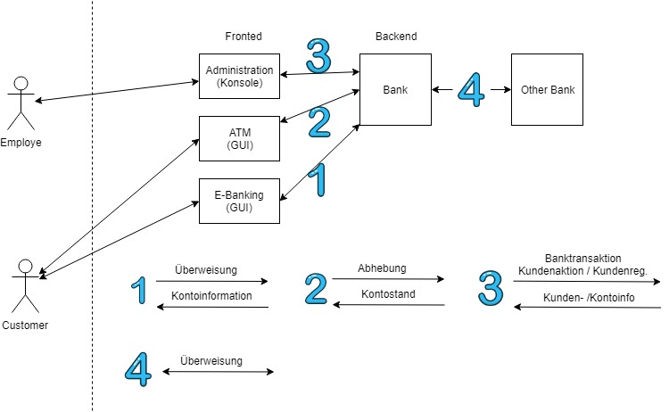
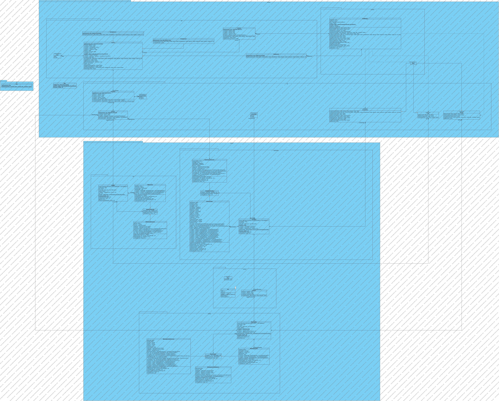
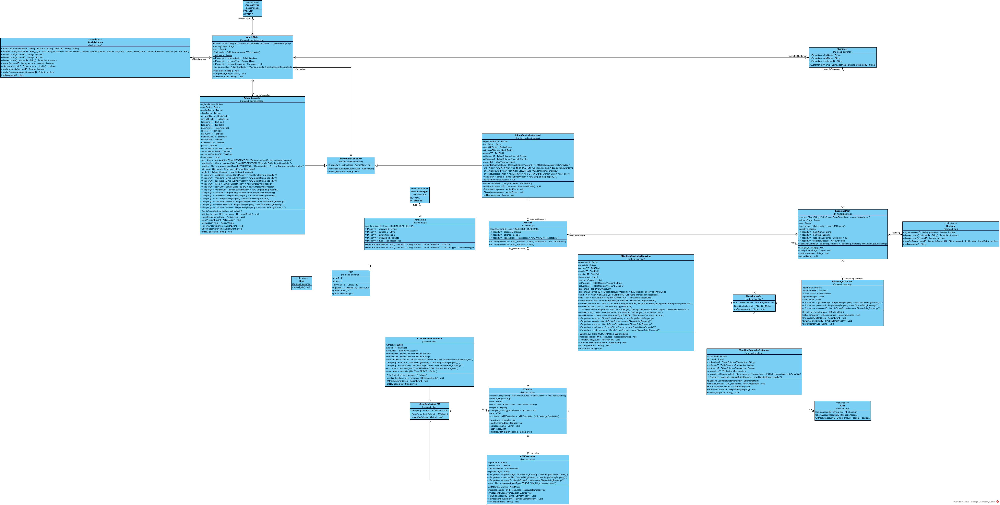
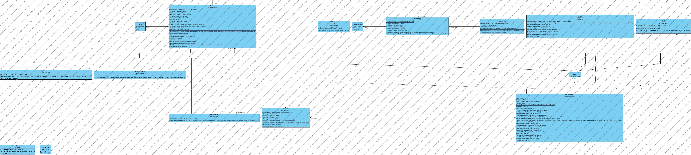
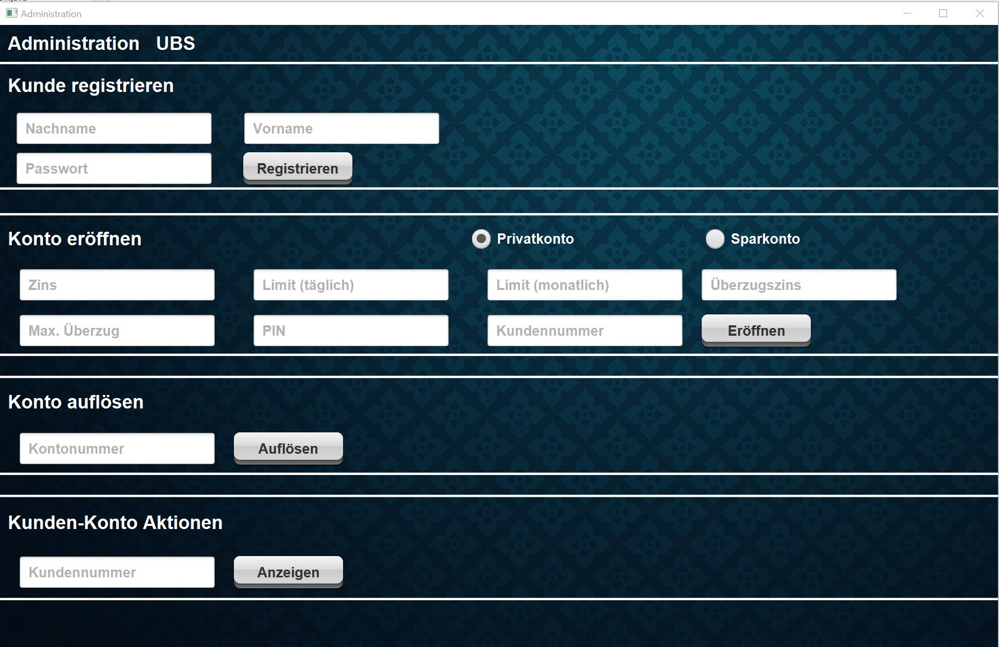
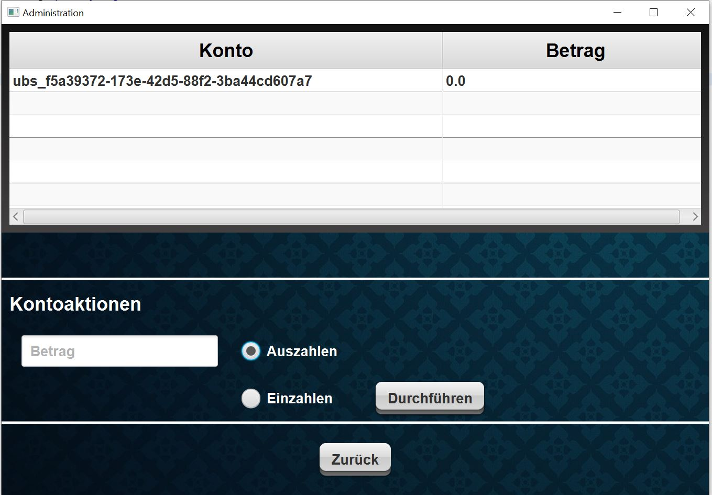
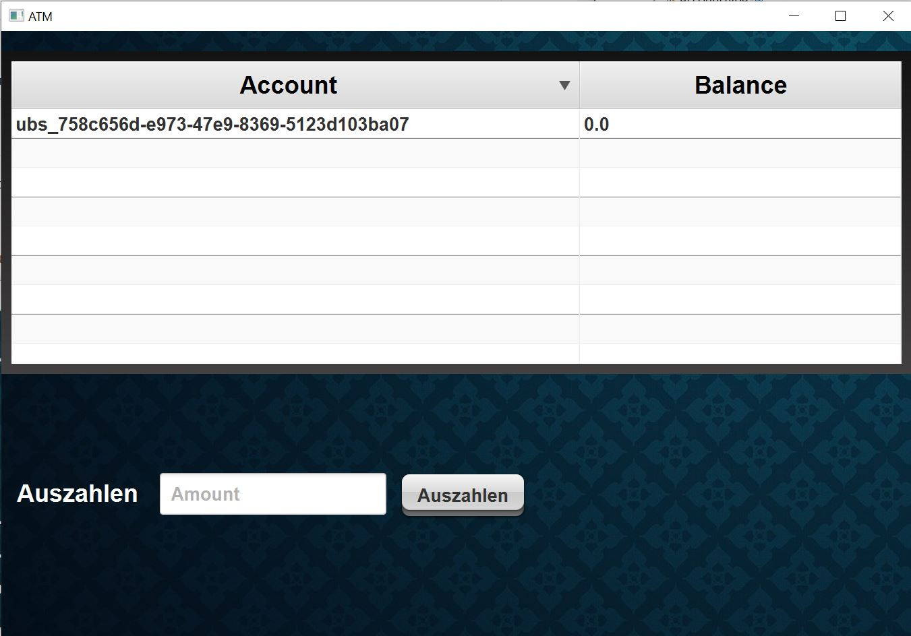
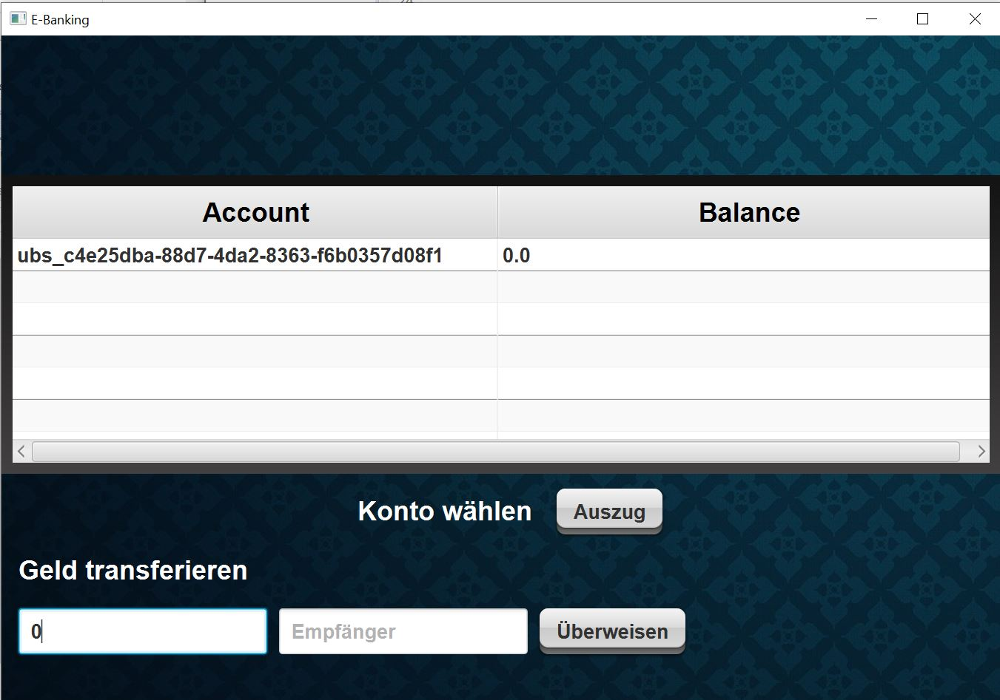

# OOP1-Projekt
    Ein Projekt von Fabian Küng und Oliver Kunz der Klasse I1s. 
    Im Rahmen des Moduls "BTI7051 - Objektorientierte Programmierung 1" an der Berner Fachhochschule (BFH).

## Ziel
Als Beispielanwendung soll ein verteiltes Bankensystem entwickelt werden.

## Funktionale Anforderungen
-   Bankangestellte können Kunden bei der Bank regsitrieren und für die Kunden neue Konten eröffnen. Wenn ein Kunde ein Konto nicht mehr benötigt, kann es aufgelöst werden.
-   Es gibt zwei Kontotypen: Ein  **Privatkonto**  hat einen kleinen Zins und darf bis zu einer individuellen Überziehungslimite überzogen werden. Ein  **Sparkonto**  hat einen höheren Zins, darf aber nicht überzogen werden. Alle Konten haben eine individuelle Tages-Rückzugslimite.
-   Eine Bankangestellte kann einem Kunden Auskunft über den aktuellen Kontostand seiner Konten geben, für den Kunden Geld auf eines seiner Konten einzahlen bzw. Geld von einem seiner Konten abheben und auszahlen.
-   Ein Kunde kann sich zuhause mit seiner Kundennummer und seinem Passwort bei der Bank anmelden und erhält eine Übersicht über seine Konten. Nach Auswahl eines Kontos erhält er einen Auszug des Kontos und kann Geld auf ein anderes Konto (der eigenen oder einer anderen Bank) überweisen.
-   Ein Kunde kann mit der Kontonummer und dem PIN des Kontos an einem Bankomaten den aktuelle Kontostand abfragen oder Geld abheben (unter Berücksichtigung der Tages-Rückzugslimite).

## Nicht-funktionale Anforderungen
-   Die Schalter-Applikation kann als Konsole-Applikation realisiert werden, die E-Banking- und Bankomat-Applikation sollen ein GUI aufweisen.
-   Für die Persistierung der Kunden- und Kontodaten kann eine bestehende Bibliothek verwendet werden (siehe  [Persistenz](http://www.sws.bfh.ch/~fischli/courses/info/oop1/persistenz.html)).
-   Klassen, welche Applikationslogik enthalten, sollen mit  [JUnit](https://junit.org/junit4/)-Tests getestet werden.
-   Es soll eine knappe Dokumentation erstellt werden, welche den Entwurf, die Implementierung und den Betrieb des Bankensystems beschreibt.

## Optionale Anforderungen

-   Alle Klassen sollen mit  [Javadoc](https://docs.oracle.com/javase/8/docs/technotes/guides/javadoc/)  dokumentiert werden.
-   Methoden, welche Applikationslogik ausführen, sollen die entsprechenden Aufrufe in eine Logdatei protokollieren (siehe  [Java Logging](http://www.sws.bfh.ch/~fischli/courses/info/oop1/slides/logging.html)).
-   Es soll möglich sein, mehrere konfigurierbare Banken zu starten (siehe  [Properties](https://docs.oracle.com/javase/8/docs/api/java/util/Properties.html)).
-   Eine Bank soll ihre Konten periodisch verzinsen (siehe  [Timer](https://docs.oracle.com/javase/8/docs/api/java/util/Timer.html)).

## Anwendungsfalldiagramm


## Systemdiagramm


## Klassendiagramm
### Gesamtsystem


### Frontend


### Backend


## JavaDoc
Das generierte Javadoc findet sich unter /doc

## Starten des Projektes
### Eclipse
Das Projekt kann entweder über Eclipse gestartet werden oder auch direkt die .jars. Diese befinden sich unter /jars

Falls man das Projekt über Eclipse ausführt, muss man bei den "Run Configurations" für das E-Banking sowie Administration jeweils noch konfigurieren, auf welche Bank zugegriffen werden soll. Dazu kann man bei den "Program Arguments" in den "Run Configurations" die ID der Bank hinterlegen z.B. "ubs" (aus der bank.properties Datei). 
Danach muss zuerst im Package "Backend" das main.java ausgeführt werden um das Backend zu initialisieren.
Anschliessend können nach belieben die "Mains" der jeweiligen Applikationen im Frontend gestart werden.

### Kommandozeile
Beim Ausführen über die Kommandozeile, können die jars wie folgt gestartet werden.

````
java -Djava.util.logging.config.file=logging.properties -jar backend.jar
java -jar ebanking.jar <bank id>
java -jar administration.jar <bank id>
java -jar atm.jar
````

## Konfiguration der Banken
Die Banken können über die Datei "bank.properties" konfiguriert werden. Jede Bank wird wie folgt definiert:
````
bank.<index>.id=<id>
bank.<index>.name=<id>
````

Also zum Beispiel
````
bank.1.id=raif
bank.1.name=Raiffeisen
````

## Konfiguration für Logging
Das Logging kann über die Datei "logging.properties" konfiguriert werden. Falls nicht anders konfiguriert, werden die Logs in die Datei log.txt sowie in die Console ausgegeben. Es wird jeweils die Applikationslogik des Backends geloggt. Dies umfassen Informationen, Warnungen sowie Fehler. 

Das Logformat wurde wie folgt definiert:
````
%1$tF %1$tT [%4$s] %2$s: %5$s%n

019-01-19 19:40:54 [INFORMATION] backend.business.BankManager transfer: [ubs] Transaction successfully done

````

## Genereller Aufbau der Applikation
Die Applikation ist in einen Backend- sowie Frontendbereich aufgeteilt. Beide befinden sich im gleichen Projekt und teilen sich das Paket "backend.api" welche als Schnittstelle dient. 

Das Frontend ist in drei Client, die Administration, das E-Banking sowie den Bankomaten aufgeteilt. 

Das Backend sowie die API verwenden verschiedene Models, da nicht alle Attribute vom Backend an das Frontend publiziert werden soll (Zum Beispiel Passwörter). 

Das Privatkonto sowie Sparkonto wurden beide als der gleiche Account berücksichtigt. Jedoch muss man bei dem Sparkonto zum Beispiel angeben, dass das Konto nicht überzogen werden darf. Auch der Zins muss unterschiedlich angegeben werden. 

Jede Bank besitzt selbst auch ein Konto, dies wird vor allem beim Einzahlen sowie Auszahlen auf ein Privat- / Sparkonto verwendet. 

## Kommunikation des Frontends mit dem Backend
Die Clients (Administration, E-Banking sowie Bankomat) kommunizieren mit RMI (remote method invocation) über Port 2001 mit dem Backend. Für jeden Client steht jeweils eine Schnittstelle zur Verfügung, um die Funktionen zur Verfügung zu stellen. Die Administration und das E-Banking kommunizieren jeweils mit der konfigurierten Bank, der Bankomat hingegen kann mit allen Banken kommunizieren.  

Beim RMI Server wird für jede Bank jeweils nur ein Binding erstellt, auf welches sich alle Clients verbinden. Es wäre so theoretisch möglich, sich als einen anderen Client auszugeben, was ein potenzielles Sicherheitsrisiko darstellt. Da dies jedoch ein Schulprojekt ist, wird darauf verzichtet, dies umfangreich abzusichern (Würde auch nicht reichen ein separates Binding zu erstellen). 
Die Kommunikation geschieht unverschlüsselt, was natürlich auch angepasst werden müsste. 

## Aufbau des Backends
Der zentrale Bestandteil des Backends ist der BankManager, welcher die Interfaces der Clients implementiert. Er behandelt die Applikationslogik und dient als Server für die Clients. 

Der Server generiert für jeden Kunden eine eindeutige UUID als eindeutige Identifikation. Bei den Kontonummern dient die Bank ID als Präfix der Zuweisung zur richtigen Bank (bsp. raif-1234-1234...). So kann zum Beispiel der Bankomat unterscheiden, zu welcher Bank das Konto gehört. Auch die Banken können so unterscheiden, ob es eine interne oder externe Transaktion ist und ggf. die andere Bank über RMI aufrufen. 

### Persistierung der Daten
Die Daten werden mit der zur Verfügung gestellten Bibliothek persitiert. Um Datenverluste (Bspw. beim Absturz)  zu vermeiden, wird bei jeder Änderung alles gespeichert. 

## Testing
Für das Testing wurden JUnit5 Unit-Tests sowie RMI Integrationstests implementiert. Sie befinden sich im Verzeichnis /tests. Es wird jeweils die Applikationslogik des Backends getestet. 

## Aufbau des Frontends
Das Frontend wurde mit fxml implementiert. Alle drei Clients wurden jeweils mit JavaFX implementiert, auf eine Konsolenapplikation wurde der Benutzerfreundlichkeit zuliebe verzichtet. 
Jedes View besitzt zugleich einen Controller, welcher die Logik beinhaltet. 

## Bedienung des Frontends
Nachfolgend eine Übersicht, sowie Kurzanleitung für alle Frontend-Applikationen.
Generell gilt, dass alle Felder korrekt ausgefüllt werden müssen um eine Aktion durchzuführen, z.B. dürfen bei Vor- und Nachnamen natürlich nur Buchstaben aber keine Zahlen eingegeben werden
Welcher Input im jeweiligen Feld erwartet wird, ist im Feld selber in grau angezeigt.

Nach allen Aktionen wird ein Dialog-Fenster angezeigt, ob die gewünschte Aktion erfolgreich war oder es beim Input noch Fehler gibt.

### Kundenadministration
Die Administration wird von den Bankangestellten verwendet um Kunden und Konten zu eröffnen und zu verwalten.
Speziell zu beachten gilt es, dass beim Registrieren eines Kunden oder Anlegen eines Kontos, jeweils die Kunden- oder Kontonummer in den Zwischenspeicher kopiert wird. 
So kann die Kunden- oder Kontonummer gleich weiterverwendet werden.

#### Übersicht der Administration:


Die Bankangestellten sind in der Lage eine Übersicht über alle Konten eines Kunden anzeigen zu lassen.
Um Geld ein- oder auszahlen zu können muss das gewünschte Konto in der Tabelle ausgewählt werden.
Nach einer erfolgreichen Transaktion wird das Guthaben aktualisiert.

#### Konten-Übersicht eines Kunden:


### Bankomat (ATM)
Mit Kontonummer und entsprechender PIN kann man sich am ATM anmelden.
Es wird der Kontostand des Kontos angezeigt, ausserdem kann man sich Geld auszahlen lassen.
Der ATM verbindet sich mit der Bank, zu der das beim Login eingegebene Konto gehört.

#### ATM-Bildschirm:


### E-Banking
Mit Kundennummer und dem dazugehörigen Passwort ist ein Anmelden im bankeigenen E-Banking möglich.
In der Tabelle werden alle Konten angezeigt, welche der jeweilige Kunde besitzt.
Nach Auswahl eines Kontos (Klick auf die Kontonummer in der Tabelle) kann ein Auszug aller Transaktionen geneeriert werden.
Im E-Banking ist es auch möglich Geld auf andere Konten zu Überweisen.

#### E-Banking Übersicht:


Der Kontoauszug wird auch tabellarisch dargestellt, mit Sender, Empfänger und dem Betrag der transferiert wurde.
Ist kein Sender eingetragen, so wurde das Geld vom gleichen Inhaber via Bankangestellter in der Administration eingezahlt (siehe Beispiel unten).

#### E-Banking Kontoauszug:

